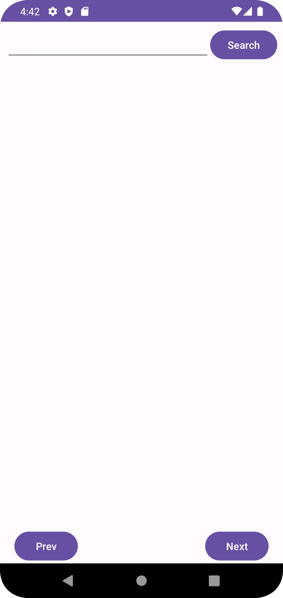
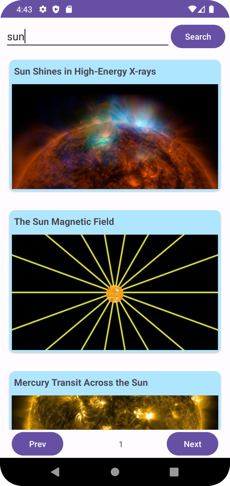
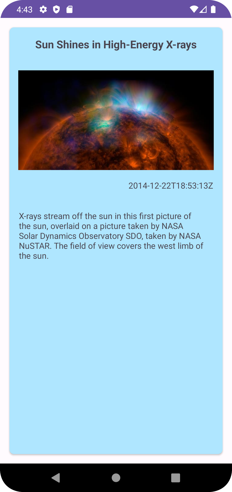
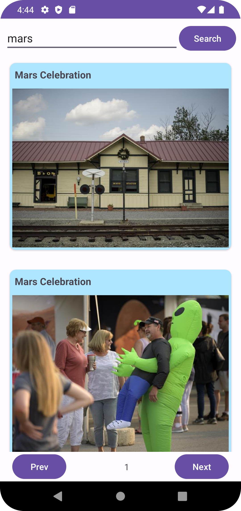

# NASA Mobile App

## Description
This project involves creating a mobile application that utilizes the NASA image API. The app allows users to search for specific content and displays the results through an intuitive user interface.

## Additional Libraries Used
- **OKHttp**: Used in conjunction with Retrofit to handle API calls efficiently.
- **Retrofit**: Utilized for fetching data from the NASA image API.
- **Picasso**: Used for image processing since Retrofit is not compatible with image handling.

## Architecture: MVC (Model-View-Controller)

The choice of using the MVC (Model-View-Controller) architecture for the NASA Mobile App was driven by the specific requirements and purpose of the application. The following reasons outline why MVC was selected:

1. **Separation of Concerns**: MVC promotes a clear separation of concerns by dividing the application into three main components: the model, the view, and the controller. Each component has a distinct responsibility, which leads to better code organization and maintainability.

2. **User Interaction**: The purpose of the NASA Mobile App is to allow users to search for specific content and interact with the search results to find additional details. MVC provides a structured approach to handle user interactions by separating the user interface (view) from the data handling (model) and the logic that controls the flow of the application (controller).

3. **Scalability and Reusability**: By adhering to the MVC architecture, the application's codebase can be more modular and reusable. The separation of concerns allows for independent development and modification of each component, enabling scalability and easier maintenance as the application evolves.

4. **Testing and Debugging**: The clear separation of concerns in MVC simplifies the testing and debugging process. Each component can be tested individually, making it easier to identify and fix issues. Additionally, the decoupling of the model and view allows for more effective unit testing.

In summary, the MVC architecture was chosen for the NASA Mobile App because it provides a structured and organized approach to handle user interactions, separates concerns effectively, promotes code reusability, and simplifies testing and debugging.

<table>
  <tr>
    <td>
      
    </td>
    <td>
      
    </td>
    <td>
      
    </td>
    <td>
      
    </td>
  </tr>
</table>


## How to Run the Application
To run the NASA Mobile App on Android Studio, follow these steps:

## How to Run the Application
To run the NASA Mobile App on Android Studio, follow these steps:

1. Clone the repository from GitHub:
   ```
   git clone https://github.com/your-username/NASA_Mobile_App.git
   ```

2. Open Android Studio and select "Open an existing Android Studio project."

3. Navigate to the location where you cloned the repository and select the project folder.

4. Android Studio will sync the project and build the necessary files. Wait for the process to complete.

5. Connect an Android device to your computer or set up an Android Virtual Device (AVD) using the AVD Manager in Android Studio.

6. Ensure that your Android Studio and Android device/emulator meet the minimum requirements for running the app. The NASA Mobile App requires **APK version 31 or higher**.

7. Once the project is synced and the device is connected, click on the "Run" button (green triangle) in the Android Studio toolbar.

8. Select the target device or emulator you want to run the app on and click "OK."

9. Android Studio will build the app and install it on the selected device/emulator. Wait for the installation process to complete.

10. Once the installation is finished, the NASA Mobile App will launch automatically on the device/emulator, and you can start using it to search for NASA images.

Note: If you encounter any issues during the setup or running of the application, refer to the project's documentation or seek assistance from the project's community or maintainers.

Please note that this document provides an overview of the NASA Mobile App project. For detailed technical information, please refer to the project's code and documentation.
